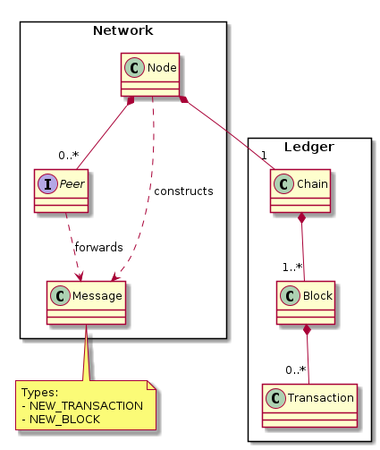

# Blockchain

## Overview
This project is a small, educational blockchain implemented in C++.
It demonstrates the core building blocks of blockchain technology:
- Blocks
- Transactions
- Proof-of-Work Mining
- Chain Validation

## Architecture
The project is organized into several submodules:

- **Crypto** — maintains the cryptographic utilities
- **Ledger** — manages the Chain, Blocks, and Transactions  
- **Network** — handles Peers, Messages, and Node coordination

The diagram below shows the high-level relationships between these components.



## Build

### Dependencies
This project requires the following tools and libraries:

- **C++17 compiler** — GCC, Clang, or MSVC  
- **CMake 3.10+** — for configuring the build  
- **libsodium** — used for cryptographic hashing and signatures  
- **GoogleTest** — used for unit tests (automatically fetched via CMake)  
- **Make** or **Ninja** — any standard build tool supported by CMake

### Using CMake
```bash
mkdir build
cd build
cmake ..
make
ctest
```
